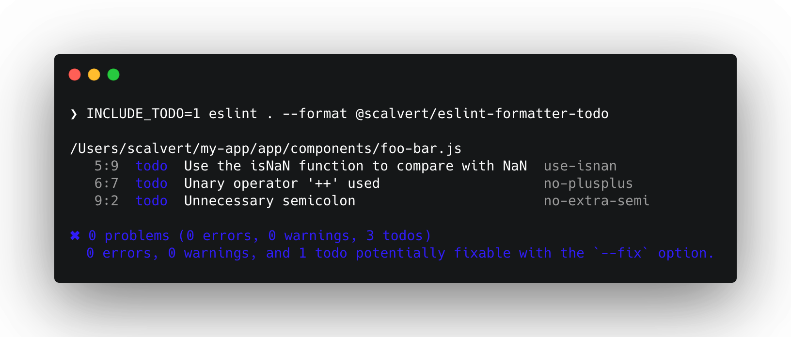

# @lint-todo/eslint-formatter-todo


[](https://badge.fury.io/js/%40lint-todo%2Feslint-formatter-todo)
[](https://github.com/@lint-todo/eslint-formatter-todo/blob/master/package.json)


[](#badge)

> An ESLint formatter that can report errors as todos, which can be deferred and fixed at a later time.

Linting is a fundamental tool to help ensure the quality of a codebase. Ensuring there are as few linting errors as possible (ideally 0), is a useful measure of a baseline of code hygiene.

It's common to leverage linting not just for syntax adherence, but also to direct developers to employ standardized patterns. As such, it's a fairly routine activity to introduce new lint rules into a codebase. This introduction, while necessary, can cause unintended friction, such as:

- new lint errors being introduced where they previously didn't exist
- causing unintended delays to shipping new fixes and features
- an "all or nothing" approach, where new rules require fixing before rollout

Having the ability to identify violations as `todo`s allows for this incremental roll out, while providing tools that allow maintainers to view the full list of todo violations.

This formatter allows you to introduce new rules immediately, without blocking commits, by taking a snapshot of errors and transforming them to todos. Errors not found in this snapshot will continue to reported as errors.

## Usage

Todos are stored in a `.lint-todo` directory that should be checked in with other source code. Each error generates a unique file, allowing for multiple errors within a single file to be resolved individually with minimal conflicts.

To convert errors to todos, you can use the `UPDATE_TODO` environment variable. This will convert all active errors to todos, hiding them from the linting output.

```bash
UPDATE_TODO=1 eslint --format @lint-todo/eslint-formatter-todo
```

If you want to see todos as part of `eslint`'s output, you can include them



If an error is fixed manually, `eslint` will automatically remove the todo when run again.

```bash
eslint . --format @lint-todo/eslint-formatter-todo
```

If you want to opt out of this behavior, you can run with the `NO_CLEAN_TODO` env var set.

```bash
# Will not remove the todo automatically
NO_CLEAN_TODO='1' eslint . --format @lint-todo/eslint-formatter-todo
```

To compact the `.lint-todo` storage file, you can use the `COMPACT_TODO` environment variable.

```bash
COMPACT_TODO=1 eslint . --format @lint-todo/eslint-formatter-todo
```

### Configuring Due Dates

Todos can be created with optional due dates. These due dates allow for todos to, over a period of time, 'decay' the severity to a **warning** and/or **error** after a certain date. This helps ensure that todos are created but not forgotten, and can allow for better managing incremental roll-outs of large-scale or slow-to-fix rules.

Due dates can be configured in one of two ways, but both specify integers for `warn` and `error` to signify the number of days from the `todo` created date to decay the severity.

:bulb: Both `warn` and `error` are optional. The value for `error` should be greater than the value of `warn`.

1. Via package.json configuration

   ```json
   {
     "lintTodo": {
       "eslint": {
         "decayDays": {
           "warn": 5,
           "error": 10
         }
       }
     }
   }
   ```

1. Via `.lint-todorc.js`

   ```js
   module.exports = {
     eslint: {
       daysToDecay: {
         warn: 5,
         error: 10,
       },
     },
   };
   ```

1. Via environment variables

   ```bash
   UPDATE_TODO='1' TODO_DAYS_TO_WARN="5" TODO_DAYS_TO_ERROR="10" eslint . --format @lint-todo/eslint-formatter-todo
   ```

   In order of precedence, environment variables override package.json configuration values.

   For example, if you've specified the following values in the package.json configuration...

   ```json
   {
     "lintTodo": {
       "eslint": {
         "decayDays": {
           "warn": 5,
           "error": 10
         }
       }
     }
   }
   ```

   ...and you supply the following environment variables:

   ```bash
   UPDATE_TODO='1' TODO_DAYS_TO_WARN= '2' eslint . --format @lint-todo/eslint-formatter-todo
   ```

   ...the todos will be created with a `warn` date 2 days from the created date, and an `error` date 10 days from the created date.

### Configuring Due Dates for Individual Rules

Due dates can be configured on a per-rule basis with the `daysToDecayByRule` option. See examples below.

1. Via `package.json`

   ```json
   {
     "lintTodo": {
       "eslint": {
         "daysToDecay": {
           "warn": 5,
           "error": 10
         },
         "daysToDecayByRule": {
           "no-plus-plus": {
             "warn": 10,
             "error": 20
           }
         }
       }
     }
   }
   ```

1. Via `.lint-todorc.js`

   ```js
   module.exports = {
     eslint: {
       daysToDecay: {
         warn: 5,
         error: 10,
       },
       daysToDecayByRule: {
         'no-plus-plus': {
           warn: 10,
           error: 20,
         },
       },
     },
   };
   ```

### Due Date Workflows

Converting errors to todos with `warn` and `error` dates that transition the `todo` to `warn` after 10 days and `error` after 20 days:

```bash
UPDATE_TODO='1' TODO_DAYS_TO_WARN= '10' TODO_DAYS_TO_ERROR='20' eslint . --format @lint-todo/eslint-formatter-todo
```

Converting errors to todos with `warn` and `error` dates that transition the `todo` `error` after 20 days, but doesn't include a `warn` date:

```bash
UPDATE_TODO='1' TODO_DAYS_TO_WARN= '' TODO_DAYS_TO_ERROR='20' eslint . --format @lint-todo/eslint-formatter-todo
```

### Additional options for formatting output

This package will only format the data in todos with the pretty format. 

If you need to preserve the todo functionality while outputting in a different format for your CI system, you can set an additional environment variable, `FORMAT_TODO_AS`, which references a node module that is installed in your project. 

:warning: Note that additional functionality of this formatter is not supported (i.e., `UPDATE_TODO`, etc) when using the `FORMAT_TODO_AS` flag; this flag is strictly for modifying the command line output.

```bash
FORMAT_TODO_AS=@microsoft/eslint-formatter-sarif eslint . --format @lint-todo/eslint-formatter-todo
